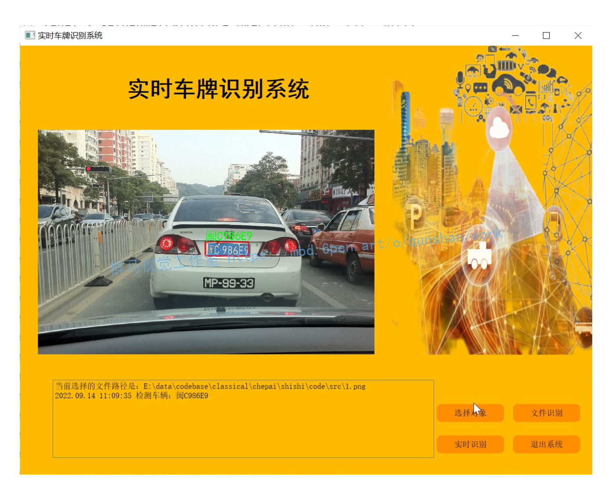
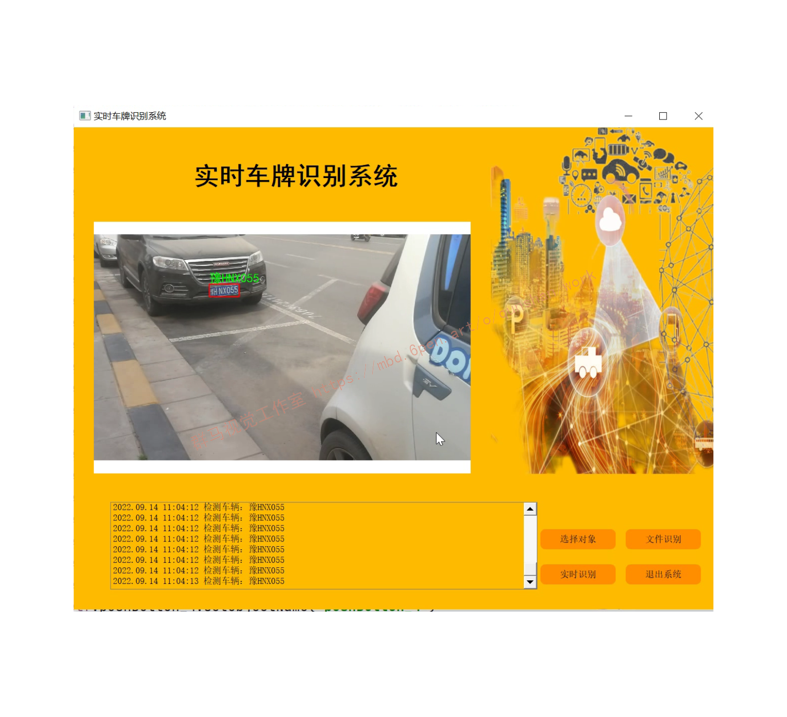
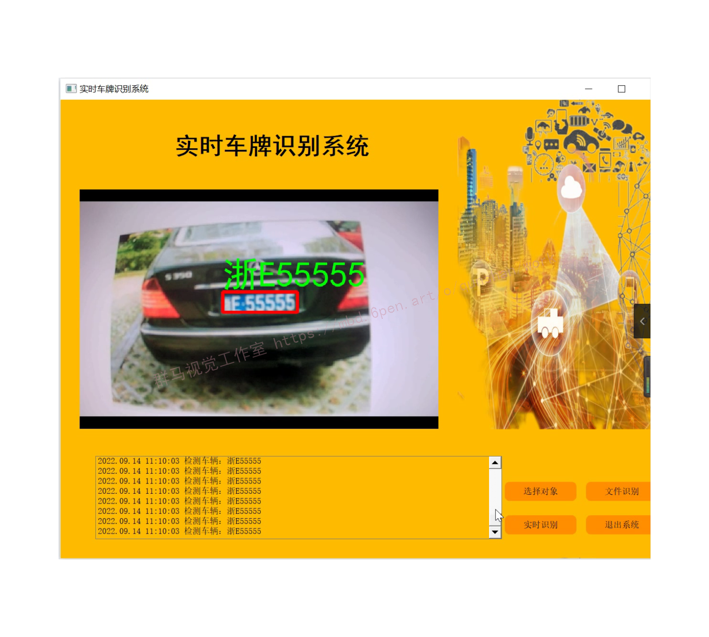
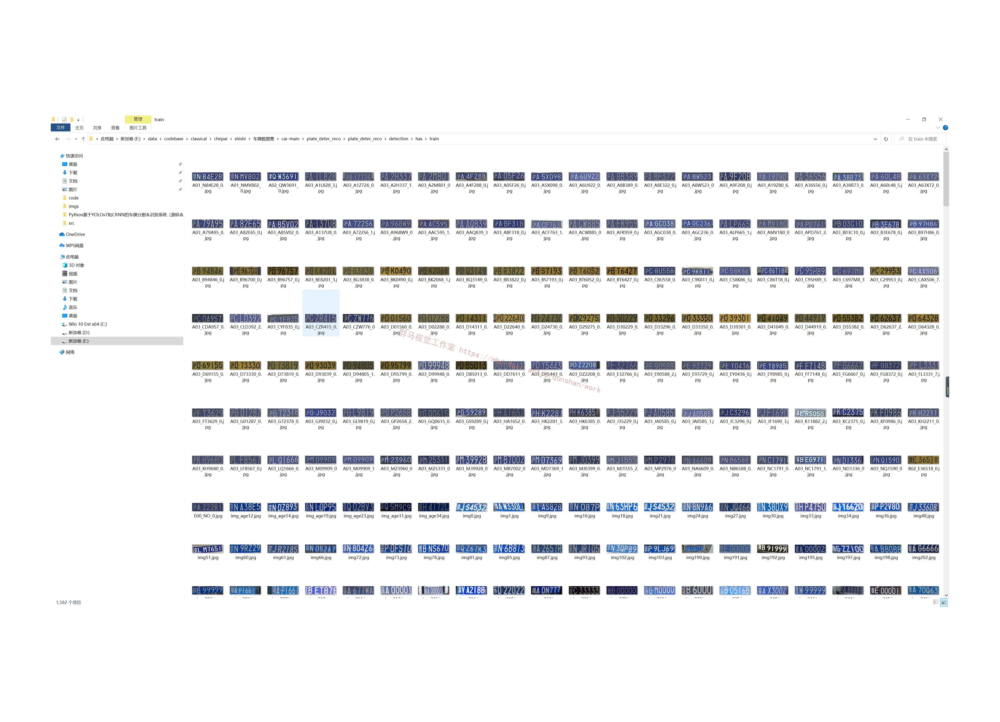
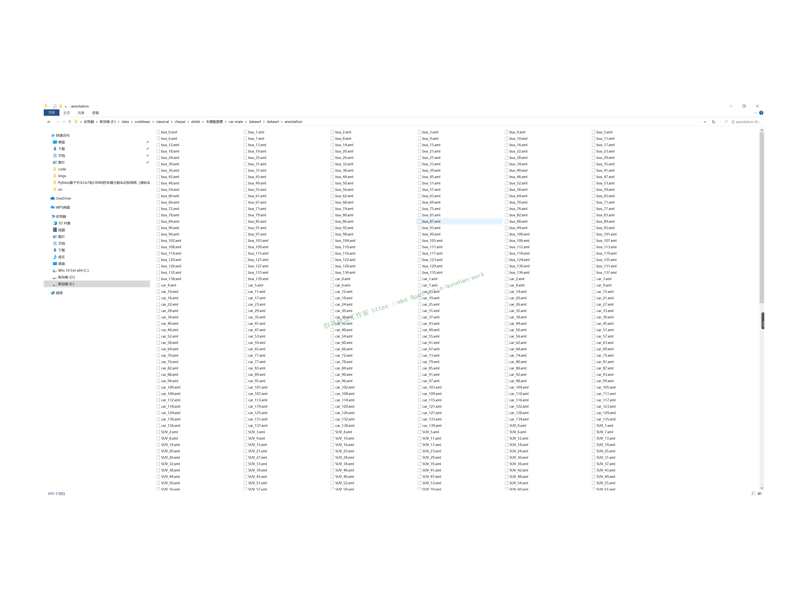
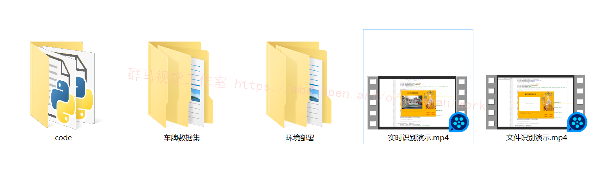

# 1.研究背景
近年来,智能交通系统(ITS)在我国应用日益广泛。作为ITS重要组成部分的自动车牌识别系统在交通流量检测、交通诱导控制、违章车辆监控等方面有着广泛的应用,是确保道路安全畅通的重要手段,也为统计有关资料,为管理者决策提供有效数字依据的重要途径。由于一般的识别系统单幅图像的检测时间较长,达不到实时的要求,从而限制了这种系统在某些方面的应用,比如不停车监控、收费等。而且,即使在固定的地方使用,也必须埋设地感线圈等触发装置,施工及维护都有一定的困难。因此,发展基于视频图像的快速准确的车牌识别系统,具有广阔的发展前景和巨大的经济价值。

# 2.支持图片识别：



# 3.支持视频识别：



# 4.支持实时识别：



# 5.视频演示：
[Python基于OpenCV的视频车牌识别（源码＆教程）上半篇_哔哩哔哩_bilibili](https://www.bilibili.com/video/BV11G4y1q7WB/?vd_source=bc9aec86d164b67a7004b996143742dc)
[实时视频流车牌识别（源码）下半篇_哔哩哔哩_bilibili](https://www.bilibili.com/video/BV1qP4y1d7QP?spm_id_from=333.999.0.0&vd_source=bc9aec86d164b67a7004b996143742dc)

# 6.实现原理：
[参考博客提出的如下可调用函数](https://afdian.net/item?plan_id=80488aa85cd611edb70952540025c377)
入口文件 demo.py(部分)：
```
import HyperLPRLite as pr
import cv2
import numpy as np
grr = cv2.imread("images_rec/2_.jpg")
model = pr.LPR("model/cascade.xml","model/model12.h5","model/ocr_plate_all_gru.h5")
for pstr,confidence,rect in model.SimpleRecognizePlateByE2E(grr):
        if confidence>0.7:
            image = drawRectBox(grr, rect, pstr+" "+str(round(confidence,3)))
            print "plate_str:"
            print pstr
            print "plate_confidence"
            print confidence

cv2.imshow("image",image)
cv2.waitKey(0)
```
(1) opencv2的imread函数导入图片, 返回的是Mat类型。

(2) HyperLPRLiite.py中的LPR类构造函数导入model， 参数就是训练好的三个模型文件，名字分别是：
- model/cascade.xml
- model/model12.h5
- model/ocr_plate_all_gru.h5
#### HyperLPRLite.py：
```
class LPR():
    def __init__(self,model_detection,model_finemapping,model_seq_rec):
        self.watch_cascade = cv2.CascadeClassifier(model_detection)
        self.modelFineMapping = self.model_finemapping()
        self.modelFineMapping.load_weights(model_finemapping)
        self.modelSeqRec = self.model_seq_rec(model_seq_rec)
```
(3)参数 model_detection 就是文件 model/cascade.xml
用到了 opencv2的CascadeClassifier()函数
cv2.CascadeClassifier()
参数输入.xml或者.yaml文件，表示加载模型
一种基于Haar特征的级联分类器用于物体检测的模型
####  model.SImpleRecognizePlateByE2E()函数:
```
for pstr,confidence,rect in model.SimpleRecognizePlateByE2E(grr):
        if confidence>0.7:
            image = drawRectBox(grr, rect, pstr+" "+str(round(confidence,3)))
            print "plate_str:"
            print pstr
            print "plate_confidence"
            print confidence
```
输入为一个Mat类型的图片
输出为识别的车牌字符串，以及confidence可信度，
定义在 HyperLPRLite.py：
```
    def SimpleRecognizePlateByE2E(self,image):
        images = self.detectPlateRough(image,image.shape[0],top_bottom_padding_rate=0.1)
        res_set = []
        for j,plate in enumerate(images):
            plate, rect  =plate
            image_rgb,rect_refine = self.finemappingVertical(plate,rect)
            res,confidence = self.recognizeOne(image_rgb)
            res_set.append([res,confidence,rect_refine])
        return res_set
```
其中又用到detectPlateRough()函数

[该博客有详细说明detectPlateRough函数](https://mbd.pub/o/bread/Y5aakp1r)
是返回图像中所有车牌的边框在图片中的bbox
返回的是一个表示车牌区域坐标边框的list

for循环中，对于每个识别出来的车牌用到filemappingVertical()函数
#### detectPlateRough函数
```
    def detectPlateRough(self,image_gray,resize_h = 720,en_scale =1.08 ,top_bottom_padding_rate = 0.05):
        if top_bottom_padding_rate>0.2:
            print("error:top_bottom_padding_rate > 0.2:",top_bottom_padding_rate)
            exit(1)
        height = image_gray.shape[0]
        padding =    int(height*top_bottom_padding_rate)
        scale = image_gray.shape[1]/float(image_gray.shape[0])
        image = cv2.resize(image_gray, (int(scale*resize_h), resize_h))
        image_color_cropped = image[padding:resize_h-padding,0:image_gray.shape[1]]
        image_gray = cv2.cvtColor(image_color_cropped,cv2.COLOR_RGB2GRAY)
        watches = self.watch_cascade.detectMultiScale(image_gray, en_scale, 2, minSize=(36, 9),maxSize=(36*40, 9*40))
        cropped_images = []
        for (x, y, w, h) in watches:
            x -= w * 0.14
            w += w * 0.28
            y -= h * 0.15
            h += h * 0.3
            cropped = self.cropImage(image_color_cropped, (int(x), int(y), int(w), int(h)))
            cropped_images.append([cropped,[x, y+padding, w, h]])
        return cropped_images
```
输入参数：
image_gray: 一个rgb图像，Mat类型
resize_h: 重新设定的图像大小
top_bottom_padding_rate: 表示要裁剪掉图片的上下部占比

这个函数实现的处理：
1.resize图像大小，cv2.resize函数，按照原来图像比例
2.裁剪图片，根据输入的top_bottom_padding_rate如果是0.1，那么上面裁剪掉0.1*height，下面也裁剪掉0.1*height
3.将图像从rgb转化为灰度 cv2.cvtColor函数，cv2.COLOR_RGB2GRAY
4.根据前面的cv2.CascadeClassifier()物体检测模型(3)，输入image_gray灰度图像，边框可识别的最小size，最大size，输出得到车牌在图像中的offset，也就是边框左上角坐标( x, y )以及边框高度( h )和宽度( w )
5.对得到的车牌边框的bbox进行扩大，也就是宽度左右各扩大0.14倍，高度上下各扩大0.15倍。
6.返回图片中所有识别出来的车牌边框bbox，这个list作为返回结果。

#### filemappingVertical函数
```
    def finemappingVertical(self,image,rect):
        resized = cv2.resize(image,(66,16))
        resized = resized.astype(np.float)/255
        res_raw= (np.array([resized]))[0]
        res  =res_raw*image.shape[1]
        res = res.astype(np.int)
        H,T = res
        H-=3
        if H<0:
            H=0
        T+=2;
        if T>= image.shape[1]-1:
            T= image.shape[1]-1
        rect[2] -=  rect[2]*(1-res_raw[1] + res_raw[0])
        rect[0]+=res[0]
        image = image[:,H:T+2]
        image = cv2.resize(image, (int(136), int(36)))
        return image,rect
```
输入参数：
裁剪的车牌区域图像（Mat类型），rect也是裁剪的车牌部分的图像（Mat类型）

实现处理：
1.将原来车牌图像resize大小：66*16*3
2.将原来灰度图颜色通道[0, 255]转化为float类型[0,1]
3.将输入66*16(float),输入进模型进行测试self.modelFineMapping.predict

#### modelFineMapping模型
```
class LPR():
    def __init__(self,model_detection,model_finemapping,model_seq_rec):
        self.watch_cascade = cv2.CascadeClassifier(model_detection)
        self.modelFineMapping = self.model_finemapping()
        self.modelFineMapping.load_weights(model_finemapping)
        self.modelSeqRec = self.model_seq_rec(model_seq_rec)
```
#### model_finemapping()函数
```
    def model_finemapping(self):
        input = Input(shape=[16, 66, 3])  # change this shape to [None,None,3] to enable arbitraty shape input
        x = Conv2D(10, (3, 3), strides=1, padding='valid', name='conv1')(input)
        x = Activation("relu", name='relu1')(x)
        x = MaxPool2D(pool_size=2)(x)
        x = Conv2D(16, (3, 3), strides=1, padding='valid', name='conv2')(x)
        x = Activation("relu", name='relu2')(x)
        x = Conv2D(32, (3, 3), strides=1, padding='valid', name='conv3')(x)
        x = Activation("relu", name='relu3')(x)
        x = Flatten()(x)
        output = Dense(2,name = "dense")(x)
        output = Activation("relu", name='relu4')(output)
        model = Model([input], [output])
        return model
```
keras网络模型：对车牌的左右边界进行回归
通过modelFineMapping.loadweights()函数加载模型文件
通过modelFineMapping.predict输出网络结果

输入：16*66*3 tensor
输出：长度为2的tensor
#### recognizeOne函数
对于每个车牌区域的for循环中,经过fineMappingVertical处理后输入到recognizeOne函数，进行识别
```
        for j,plate in enumerate(images):
            plate, rect  =plate
            image_rgb,rect_refine = self.finemappingVertical(plate,rect)
            res,confidence = self.recognizeOne(image_rgb)
            res_set.append([res,confidence,rect_refine])
```
#### recognizeOne()
```
    def recognizeOne(self,src):
        x_tempx = src
        x_temp = cv2.resize(x_tempx,( 164,48))
        x_temp = x_temp.transpose(1, 0, 2)
        y_pred = self.modelSeqRec.predict(np.array([x_temp]))
        y_pred = y_pred[:,2:,:]
        return self.fastdecode(y_pred)
```
1.将前面的(136, 36)图像resize成(164, 48)
2.将图像转置，输入

#### model_sec_rec函数
```
    def model_seq_rec(self,model_path):
        width, height, n_len, n_class = 164, 48, 7, len(chars)+ 1
        rnn_size = 256
        input_tensor = Input((164, 48, 3))
        x = input_tensor
        base_conv = 32
        for i in range(3):
            x = Conv2D(base_conv * (2 ** (i)), (3, 3))(x)
            x = BatchNormalization()(x)
            x = Activation('relu')(x)
            x = MaxPooling2D(pool_size=(2, 2))(x)
        conv_shape = x.get_shape()
        x = Reshape(target_shape=(int(conv_shape[1]), int(conv_shape[2] * conv_shape[3])))(x)
        x = Dense(32)(x)
        x = BatchNormalization()(x)
        x = Activation('relu')(x)
        gru_1 = GRU(rnn_size, return_sequences=True, kernel_initializer='he_normal', name='gru1')(x)
        gru_1b = GRU(rnn_size, return_sequences=True, go_backwards=True, kernel_initializer='he_normal', name='gru1_b')(x)
        gru1_merged = add([gru_1, gru_1b])
        gru_2 = GRU(rnn_size, return_sequences=True, kernel_initializer='he_normal', name='gru2')(gru1_merged)
        gru_2b = GRU(rnn_size, return_sequences=True, go_backwards=True, kernel_initializer='he_normal', name='gru2_b')(gru1_merged)
        x = concatenate([gru_2, gru_2b])
        x = Dropout(0.25)(x)
        x = Dense(n_class, kernel_initializer='he_normal', activation='softmax')(x)
        base_model = Model(inputs=input_tensor, outputs=x)
        base_model.load_weights(model_path)
        return base_model
```
model_path为模型weights文件路径
ocr部分的网络模型(keras模型)
输入层：164*48*3的tensor
输出层：长度为7 的tensor，类别有len(chars)+1种
chars：
```
chars = [u"京", u"沪", u"津", u"渝", u"冀", u"晋", u"蒙", u"辽", u"吉", u"黑", u"苏", u"浙", u"皖", u"闽", u"赣", u"鲁", u"豫", u"鄂", u"湘", u"粤", u"桂",
             u"琼", u"川", u"贵", u"云", u"藏", u"陕", u"甘", u"青", u"宁", u"新", u"0", u"1", u"2", u"3", u"4", u"5", u"6", u"7", u"8", u"9", u"A",
             u"B", u"C", u"D", u"E", u"F", u"G", u"H", u"J", u"K", u"L", u"M", u"N", u"P", u"Q", u"R", u"S", u"T", u"U", u"V", u"W", u"X",
             u"Y", u"Z",u"港",u"学",u"使",u"警",u"澳",u"挂",u"军",u"北",u"南",u"广",u"沈",u"兰",u"成",u"济",u"海",u"民",u"航",u"空"
             ]
```
网络结构是三层卷积神经网络(CNN)，以及四层内控循环单元(GRU)组成
# 7.标注好的车牌数据集（文末链接提供下载）：




# 8.系统整合：

下图[源码&环境部署视频教程&数据集&自定义UI界面](https://s.xiaocichang.com/s/72c576)

参考博客[《Python基于OpenCV的实时视频流车牌识别（源码＆教程）》](https://mbd.pub/o/qunma/work)


# 9.参考文献：
***
[1]周亮,刘云.一种基于数学形态学的汽车牌照提取算法[J].电脑知识与技术（学术交流）.2007,(3).826-827.
[2]管庶安.按综合特征实现车牌快速定位[J].计算机应用与软件.2005,(6).63-64.
[3]吴大勇,魏平,侯朝桢,等.一种车牌图像中的字符快速分割与识别方法[J].计算机工程与应用.2002,(3).232-233.
[4]柴治,陶青川,余艳梅,等.一种快速实用的车牌字符识别方法[J].四川大学学报(自然科学版).2002,(3).465-468.
[5]张引,潘云鹤.彩色汽车图象牌照定位新方法[J].中国图象图形学报A辑.2001,(4).374-377.
[6]魏武,张起森,王明俊,等.一种基于模板匹配的车牌识别方法[J].中国公路学报.2001,(1).104-106.
[7]曹迪铭,宣国荣.牌照字符分割中的区域分裂与合并[J].计算机工程.2000,(10).18-20,43.
[8]张炜,王庆,赵荣椿.汽车牌照的实时识别[J].信号处理.2000,(4).372-375.
[9]沈会良,李志能.基于CCD的汽车牌照自动识别系统[J].光电工程.2000,(4).60-63,71.
[10]是湘全,何苑凌,蔡孟波.遗传算法在车牌定位中的应用[J].公路交通科技.2000,(2).33-36.
[11]蒋冰蕾.美国智能公共交通领域发展近况[J].国外城市规划.1999,(1).9-13.
[12]刘效静,成瑜.汽车牌照自动识别技术研究[J].南京航空航天大学学报.1998,(5).106-109.
[13]赵雪春,戚飞虎.基于彩色分割的车牌自动识别技术[J].上海交通大学学报.1998,(10).6-11.
[14]谢磊.智能交通系统中的视频处理技术研究[D].2006
[15]姚宇良.汽车牌照识别系统及其在智能卡口中的应用[D].2004
[16]梁栋.智能交通系统中车牌定位的研究[D].2002
[17]黄国胜.基于神经网络的实时车牌定位与识别系统研究[D].2002
[18]马俊莉.车牌字符识别算法的研究[D].2002
[19]Lienhart R.,Wernicke A..Localizing and segmenting text in images and videos[J].IEEE Transactions on Circuits & Systems for Video Technology.2002,12(4).


---
#### 如果您需要更详细的【源码和环境部署教程】，除了通过【系统整合】小节的链接获取之外，还可以通过邮箱以下途径获取:
#### 1.请先在GitHub上为该项目点赞（Star），编辑一封邮件，附上点赞的截图、项目的中文描述概述（About）以及您的用途需求，发送到我们的邮箱
#### sharecode@yeah.net
#### 2.我们收到邮件后会定期根据邮件的接收顺序将【完整源码和环境部署教程】发送到您的邮箱。
#### 【免责声明】本文来源于用户投稿，如果侵犯任何第三方的合法权益，可通过邮箱联系删除。